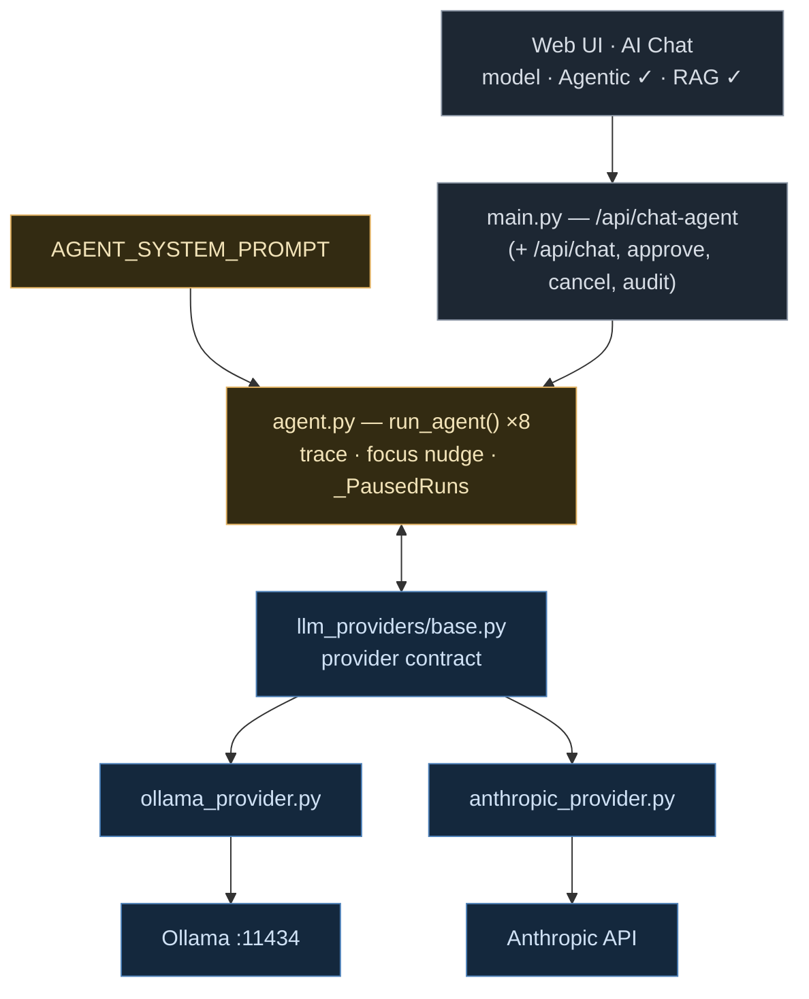
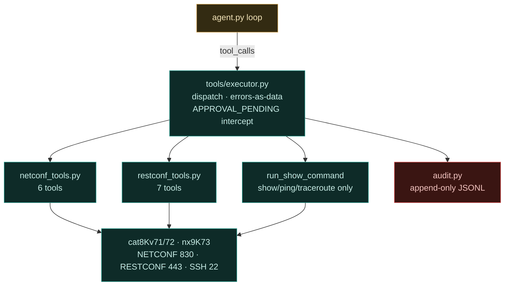
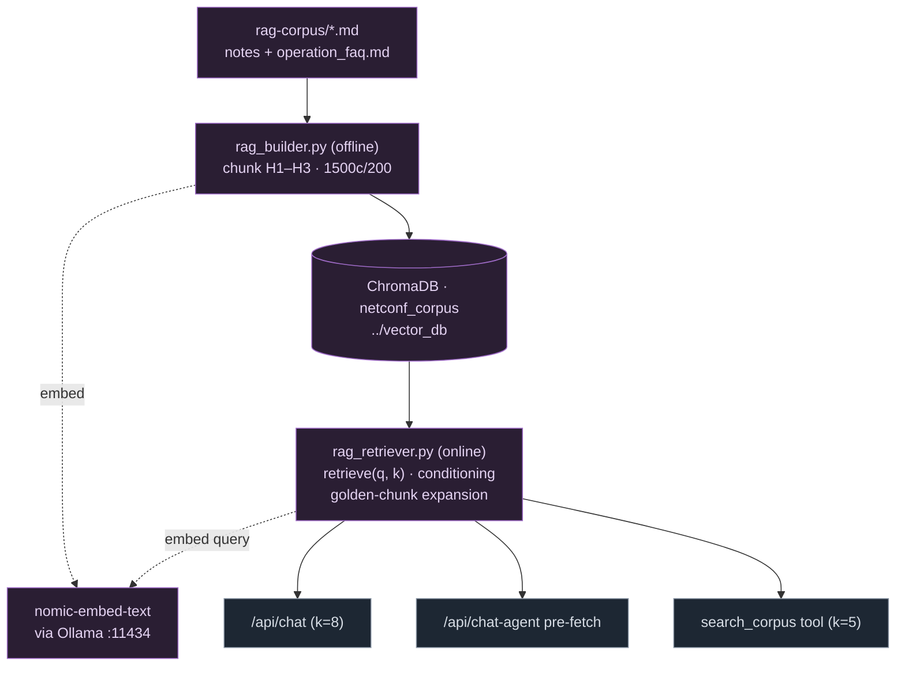
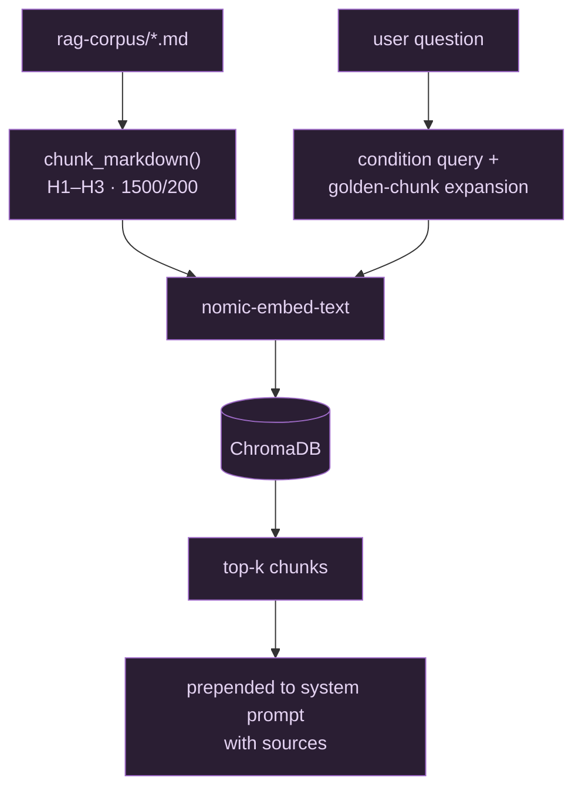
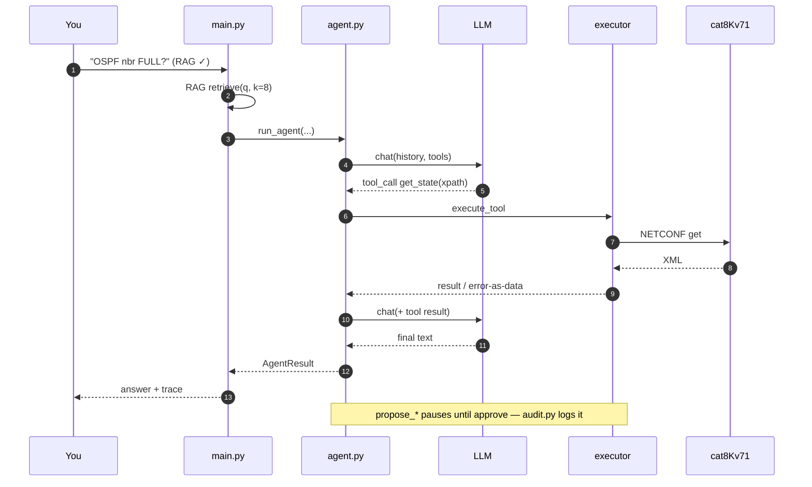

# Agentic AI + RAG — which file does what

**hiTech Automation AI · v1.48.1 · `build/` internals**

Five Python modules make the AI: one loop (`agent.py`), one provider abstraction (`llm_providers/`), one tool layer (`tools/`), and two RAG halves (`rag_builder.py` offline, `rag_retriever.py` online). `main.py` wires them to the UI. Everything else in `build/` is transport and YANG machinery the tools call into.

---

## 01 · The whole system — three views

GitHub scales diagrams to its page column, so the system is drawn as three stacked, narrow views instead of one wide sheet. Colour = subsystem: **amber = agent**, **blue = LLM providers**, **purple = RAG**, **teal = tools/devices**, **red = safety**.

### 01a · Request path — UI → agent → LLM

### 01b · Tool layer — agent → executor → devices

### 01c · RAG — build side and query side

## 02 · The files that make the Agentic AI

Agentic = the LLM chooses tools, sees results, and iterates. Four pieces, strict separation of duties:

| File | Role |
|---|---|
| `build/agent.py` (664 ln) | The ReAct loop. `run_agent()`: system prompt + history → provider → if `tool_calls` come back, execute each, append results, loop (max 8 iterations). Emits an `AgentStep` trace (llm_text / tool_call / tool_result / final) with per-step tokens, cost, timing. Also: cancellation registry (Stop button), `_PausedRuns` snapshot/resume for write approvals, focus-injection nudge that tells small models to stop calling tools and answer, and a per-run NETCONF session pool so one ncclient session serves the whole run. |
| `build/tools/definitions.py` + schemas in `netconf_tools.py`, `restconf_tools.py` | What the agent is allowed to do — 18 `ToolDefinition`s (name + description + JSON schema). The descriptions are treated as first-class API docs: they carry usage order, warnings (unprefixed XPath!), and device_name discipline, because description quality directly sets agent accuracy. |
| `build/tools/executor.py` (436 ln) | Dispatch: `execute_tool(call, ctx)` routes a `ToolCall` to its handler, returns `(result_text, is_error)`. Errors come back as data so the agent self-corrects instead of crashing. Intercepts `APPROVAL_PENDING` from propose_* tools and pauses the run. |
| `build/main.py` | Wiring + the brain's constitution: `AGENT_SYSTEM_PROMPT` (tool principles, NETCONF-vs-RESTCONF-vs-CLI transport choice, xpath-vs-subtree filter choice, RAW output markers). Endpoints: `/api/chat-agent`, `/api/agent-cancel`, `/api/agent/approve`, `/api/agent/audit`. |

## 03 · How the LLM is connected

One abstraction, two brains. `agent.py` never knows which model it's driving.

| File | Connection |
|---|---|
| `llm_providers/base.py` | The contract: `ChatProvider.chat(messages, tools) → ChatResponse`, with normalized dataclasses `ChatMessage`, `ToolDefinition`, `ToolCall`, `ChatResponse`. Tool-calling shape is identical regardless of vendor. |
| `llm_providers/ollama_provider.py` | Local brain: `POST http://192.168.89.102:11434/api/chat` with tools translated to Ollama's function format. Free (`cost_usd=None`), runtime `num_ctx` control, qwen3-coder:30b / gpt-oss:20b. |
| `llm_providers/anthropic_provider.py` | Cloud brain: `anthropic.AsyncAnthropic().messages.create()` with tools in Anthropic format; system message split out; token counts → USD cost per step. Optional import — app runs without the SDK. |

Flow of one iteration: `agent.py` → `provider.chat(history, tools)` → response with `tool_calls` → `executor.py` runs them → results appended as `role="tool"` messages → next `provider.chat()`. The model literally converses with the tool results.

## 04 · The files and contents that make the RAG

| Piece | Contents / behaviour |
|---|---|
| `rag-corpus/` (repo root) | The knowledge itself: markdown notes on NETCONF, RESTCONF, YANG, Ansible, NX-OS, CCIE study material — plus `operation_faq.md`, the deliberately Q-shaped "golden" FAQ written so retrieval lands on answer-shaped chunks. |
| `build/rag_builder.py` (337 ln, offline CLI) | Index build: read corpus → `chunk_markdown()` (split on H1–H3 headings so chunks are topic-coherent, then 1500-char pieces with 200 overlap) → embed each chunk with `nomic-embed-text` via Ollama → store vectors+text+source metadata in ChromaDB collection `netconf_corpus`. Incremental (skips indexed files), retry/backoff, model pre-warm, `--rebuild` to wipe. DB lives at `../vector_db/` — outside build/ so upgrades don't destroy it (auto-migrates old layouts). |
| `build/rag_retriever.py` (177 ln, online) | Query side: embed the question with the same model → Chroma similarity search → `format_for_prompt()` renders chunks with source filenames. v1.16.3 query conditioning; v1.17.0 golden-chunk expansion (pull an FAQ answer's siblings so it arrives whole). Also serves UI status: `rag_available()`, `rag_chunk_count()`. |
| Injection points (`main.py`) | **Three:** (1) `/api/chat` + RAG checkbox → top-8 chunks prepended before the LLM call; (2) `/api/chat-agent` → same pre-fetch, agent starts grounded; (3) the `search_corpus` **tool** — the agent can decide mid-run to search the corpus again (k=5). `/api/rag-rebuild` triggers the builder from the UI. |

## 05 · One agentic question, end to end

## 06 · Safety layer

| Mechanism | Where |
|---|---|
| **read** — CLI hard limit | `run_show_command` rejects anything not starting with show/ping/traceroute — enforced in the executor, not just the prompt. |
| **gate** — propose → approve → apply | All config-changing tools are split: `propose_*` returns `APPROVAL_PENDING`, the run freezes in `_PausedRuns`, the UI modal shows the exact payload, and only `/api/agent/approve` lets `apply_*` commit. The LLM cannot skip the human. |
| **audit** — append-only log | `tools/audit.py` — one JSON line per significant event to `~/.hitech_automation_ai/audit.log`: proof of what the agent did and who approved it. |
| **stop** — cancellation + iteration cap | Stop button → `/api/agent-cancel` → checked at every loop and tool boundary; 8-iteration ceiling bounds runaway cost. |

---

*hiTech Automation AI v1.48.1 · agent.py (ReAct) + llm_providers (Ollama/Anthropic) + tools (18) + rag_builder/rag_retriever (ChromaDB · nomic-embed-text)*
